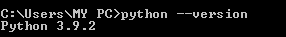
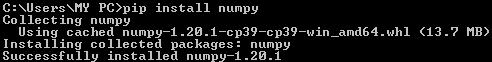
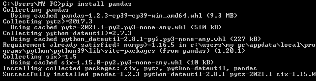
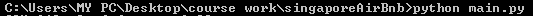
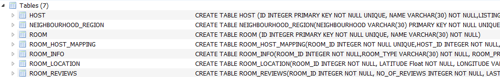
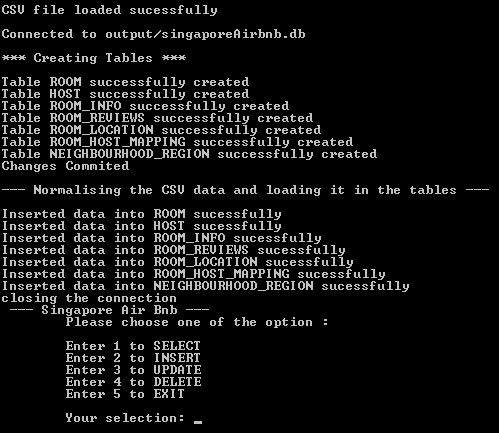
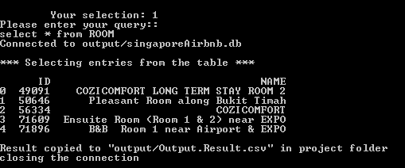

## SingaporeAirBnb
This project is SingaporeAirBnb performs below activities

- Load the csv data 
- Normalize the raw data and create multiple tables in SQLlite
- Perform CRUD operation on the data stored in SQLlite

### Project version

version 1.0

### Prerequisite

- Python (Latest version 3.9)
- Python libraries - numpy and pandas
- Pycharm (For the better visualisation of code structure)
- DN browser for SQLite


### Installation
- [Click here](https://www.python.org/downloads/) to install Python and verify once it is installed
  
  
- Use pip package manager to install numpy and pandas. Pip downloads the packages and notifies you it hs been sucessfully installed.
    ````code
    pip install numpy
    pip install pandas
    ````
    
    
- [Click here](https://www.jetbrains.com/pycharm/download) to install PyCharm (Community edition)
- [Click here](https://sqlitebrowser.org/dl/) to install DB browser for SQLite


### Executions
#### Functional Code:    src/main.py<br>
#### Unit testing:       test/test_complete.py


### Code Briefing

- Below is a simple code tree structure to give an overview of the job performed by each file generated.  
- The required data is already downloaded and placed under csvData directory.
  
  http: kaggle.com
    
  ````code
    
  |___ csvData
  |        |___ listings.csv        <- The donwloaded csv file having raw data
  |___ output
  |        |___ singaporeAirbnb.db  <- The final DB as a result of normalisation
  |        |___ Output_Result.csv    <- The csv file generated for "select" queries
  |___ src
  |       |___ database             <- Code to perform all DB actions (Connect / Commit / Rollback / Close) 
  |       |___ tables               <- Code to perform all CRUD operations
  |       |___ process              <- Code to instantiate all the operation with utilities and constant helper files
  |___ test                         <- Unit test
  |       |___ test_complete.py     <- Includes test suite to run all the test cases at a time
  |       |___ test_database.py     
  |       |___ test_process.py
  |       |___ test_table.py
  
     
    ````
  

### Project execution  

- The csv file is saved in "csvData" directory (Note: This is already done)

- The directory "output" is empty without any DB or output_result.csv

- The code can instantiated by executing the main.py file on python console as below or can also be executed with pyCharm.\

  

- Below are the series of actions within the code
  <br/><br/>

  **Step 1: Load the csv file:**
  <br/>
  "listings.csv" is loaded from "csvData" directory and store it in a data frame
 
  <br/>
  
  **Step 2: Normalisation of Data:**
  
  The current data frame has raw data and hence normalisation is performed to create multiple data frames.

  <br/>
  
  **Step 3: Cleaning the Data:**
  
  The Normalised data is now cleaned by:
  * Removing duplicate entries
  * Adding default values for NULL entries only for certain entries.
  
  <br/>
  
  **Step 4: Creating a new data base and creating tables**
  
  Once the tables are created and loaded with data, success message is shown on console
  
  <br/>

  **Step 5: Asking user inputs to perform CRUD operations**

    User is asked to choose one of the option to either INSERT / UPDATE / DELETE / SELECT
    User is also asked to enter a query to be executed

  <br/>

  **Step 6: Output is generated if SELECT query is executed**
  
    The first 5 rows of the output result is displayed and then the entire data is copied to output_Result.csv in "output" directory
    
### SQL Entries




### Console output



User input is given here  as 1 with a select query


        


### Author
Anjum Banu Ismail
Queen University Belfast
